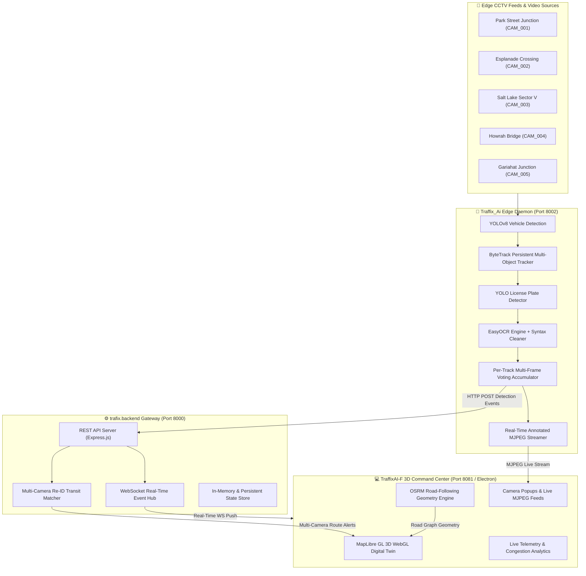

<div align="center">

# 🚦 TRAFFIX AI
### Centralized City-Wide Smart Traffic Management & Multi-Camera ANPR Digital Twin
**Smart India Hackathon (SIH 2026) Working Prototype**

[](https://github.com/mahammadanish321/TEAFFIX)
[](https://github.com/mahammadanish321/TEAFFIX)
[](https://github.com/mahammadanish321/TEAFFIX)
[](https://github.com/mahammadanish321/TEAFFIX)
[](https://github.com/mahammadanish321/TEAFFIX)

</div>

---

## 📌 Executive Summary & Problem Statement

Modern smart cities struggle with fragmented traffic surveillance, optical character recognition latency on fast-moving vehicles, and lack of unified multi-camera vehicle tracking.

**TRAFFIX AI** solves this with an end-to-end distributed architecture:
1. **Edge Computer Vision Daemon**: High-speed YOLOv8 vehicle detection, ByteTrack persistent multi-object tracking, and Deep Learning ANPR with multi-frame OCR voting.
2. **Central WebSocket & Re-ID Gateway**: Instant sub-50ms event broadcasting and multi-camera transit path correlation.
3. **3D Interactive Digital Twin Desktop Application**: Built with Electron, React Native, and MapLibre 3D WebGL, rendering real-world OpenStreetMap road network trajectories using OSRM Contraction Hierarchies.

---

## 🏗️ System Architecture



---

## ✨ Key Features & Capabilities

* 🎯 **Sub-Pixel License Plate Recognition (ANPR)**: Dedicated YOLO license plate localization + bilateral filtering + CLAHE preprocessing + EasyOCR with multi-frame consensus voting.
* 🚗 **Sticky Zero-Drop Multi-Object Tracking**: ByteTrack with 120-frame temporal buffer ensures vehicles never lose ID during headlight flare, motion blur, or distance variations.
* 🗺️ **True Road-Network 3D Routing**: Powered by OpenStreetMap and OSRM Contraction Hierarchies with Catmull-Rom spline interpolation—zero straight-line diagonal artifacts across buildings.
* 📍 **Google Maps-Style Dynamic Zoom Scaling**: Camera markers feature 3D ground-pinning needles (`pitchAlignment: 'map'`) that dynamically scale from compact dots at city-level zoom to full interactive cards at street-level zoom.
* 🔁 **Multi-Camera Re-ID & Journey Reconstruction**: Automatically correlates visual and plate signatures across different CCTV junctions to trace journey paths in real time.
* ⚡ **Ultra-Low Latency Streaming**: Multithreaded MJPEG encoding achieving smooth 30+ FPS video streaming on standard CPU hardware.

---

## ⚡ 1-Click Quickstart (For Judges & Evaluators)

### Prerequisites
* **Node.js** (v18 or higher)
* **Python** (v3.10 or higher)
* **Git**

### 🐧 Option 1: Linux / macOS (1-Click Command)
Clone the repository and run the unified launcher:
```bash
git clone https://github.com/mahammadanish321/TEAFFIX.git
cd TEAFFIX
chmod +x start.sh
./start.sh
```

### 🪟 Option 2: Windows (1-Click Command)
Clone and double-click `start.bat` or run:
```cmd
git clone https://github.com/mahammadanish321/TEAFFIX.git
cd TEAFFIX
start.bat
```

---

## 📂 Repository Structure & Modules

| Module Directory | Role & Description | Tech Stack | Port |
|:---|:---|:---|:---|
| **[`TraffixAI-F/`](./TraffixAI-F)** | 3D Command Dashboard & Desktop Application | React Native, Expo, Electron, MapLibre 3D, TypeScript | `8081` |
| **[`trafix.backend/`](./trafix.backend)** | Central Event Gateway, Re-ID Matcher & WebSocket Hub | Node.js, Express, WebSocket (ws), REST API | `8000` |
| **[`Traffix_Ai/`](./Traffix_Ai)** | Computer Vision & ANPR Live Stream Daemon | Python 3, PyTorch, YOLOv8, ByteTrack, EasyOCR, OpenCV, FastAPI | `8002` |

---

## 🛠️ Manual Step-by-Step Setup

If you prefer launching each microservice in separate terminal windows:

### 1. Start the AI Vision Daemon (Port 8002)
```bash
cd Traffix_Ai
python3 -m venv venv
source venv/bin/activate  # On Windows: venv\Scripts\activate
pip install -r requirements.txt
python server/stream_server.py
```

### 2. Start the Central Backend (Port 8000)
```bash
cd trafix.backend
npm install
npm run dev
```

### 3. Start the 3D Desktop App (Port 8081)
```bash
cd TraffixAI-F
npm install
npm run desktop
```

---

## 🧠 Algorithmic Core & Analytics

### 1. Shortest Path & Road Routing
* **Graph Engine**: Open Source Routing Machine (OSRM) with OpenStreetMap Kolkata road graph.
* **Routing Algorithm**: **Contraction Hierarchies (CH)** and **Multi-Level Dijkstra (MLD)** for $<1\text{ ms}$ shortest driving path computation.
* **Trajectory Smoothing**: **Catmull-Rom Splines** combined with **Ramer-Douglas-Peucker (RDP)** polyline simplification.

### 2. Vehicle Tracking State Machine
$$\text{State Transitions: } \text{NEW} \xrightarrow{\text{hits } \ge 3} \text{ACTIVE} \xrightarrow{\text{missed } \le 120} \text{TEMPORARILY\_LOST} \rightarrow \text{ENDED}$$

---

## 📄 License & Team Credits

Developed with ❤️ for **Smart India Hackathon (SIH 2026)**.

* **Project Lead / Author**: [Mahammad Anish](https://github.com/mahammadanish321)
* **Organization**: Smart India Hackathon (SIH) 2026

