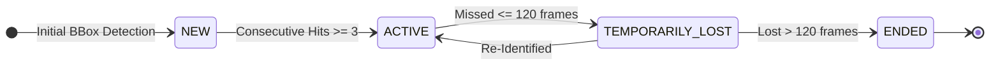

<div align="center">

# TRAFFIX AI
### Centralized City-Scale Traffic Surveillance, Edge ANPR & 3D Digital Twin Platform
**Smart India Hackathon 2026 Submission**

[](https://github.com/mahammadanish321/TEAFFIX)
[](https://github.com/mahammadanish321/TEAFFIX)
[](https://github.com/mahammadanish321/TEAFFIX)
[](https://github.com/mahammadanish321/TEAFFIX)
[](https://github.com/mahammadanish321/TEAFFIX)

</div>

---

## System Overview

Modern urban traffic management faces challenges in multi-camera vehicle tracking, recognition accuracy on high-speed vehicles, and real-time spatial path reconstruction.

**TRAFFIX AI** addresses these problems through a decoupled, three-tier distributed architecture:
1. **Edge Computer Vision Daemon**: YOLOv8 vehicle detection, ByteTrack persistent multi-object tracking, and automated number plate recognition (ANPR) with temporal voting.
2. **Central Integration Gateway**: Sub-50ms WebSocket telemetry broadcasting and cross-camera vehicle re-identification.
3. **3D Digital Twin Command Center**: WebGL-accelerated 3D geospatial environment rendering vehicle trajectories along real-world road networks using Open Source Routing Machine (OSRM).

---

## Live Prototype Demonstration

<div align="center">

<a href="https://res.cloudinary.com/dmi7vzu8w/video/upload/v1790389429/our_backend_so_poyq8j.mp4" target="_blank">
  
</a>

<p><em>Click the preview above to view the full 1080p demonstration video with audio stream.</em></p>

[](https://res.cloudinary.com/dmi7vzu8w/video/upload/v1790389429/our_backend_so_poyq8j.mp4)

</div>

---

## System Architecture

```mermaid
flowchart LR
    subgraph Edge["Edge AI & Video Ingestion (Traffix_Ai :8002)"]
        direction TB
        CCTV["CCTV Feed Ingestion<br/>Park St, Esplanade, Salt Lake, Howrah, Gariahat"]
        
        subgraph Pipeline["Computer Vision & ANPR Pipeline"]
            direction TB
            YOLO["1. YOLOv8 Vehicle Detection"]
            BT["2. ByteTrack Object Tracking"]
            LPD["3. License Plate Localization"]
            OCR["4. Bilateral Filter + EasyOCR"]
            VOTE["5. Multi-Frame Consensus Voting"]
            YOLO --> BT --> LPD --> OCR --> VOTE
        end

        STREAM["Low-Latency MJPEG Stream Server"]
        
        CCTV --> Pipeline
        CCTV -.-> STREAM
    end

    subgraph Backend["Central Hub & State Gateway (trafix.backend :8000)"]
        direction TB
        REST["REST API Server (Express.js)"]
        STORE[("In-Memory & Persistent State")]
        REID["Multi-Camera Re-ID Engine"]
        WS["WebSocket Event Gateway"]

        REST <--> STORE
        REST --> REID
        REID --> WS
    end

    subgraph Frontend["3D Digital Twin Client (TraffixAI-F :8081)"]
        direction TB
        MAP["MapLibre 3D WebGL Engine"]
        OSRM["OSRM Road Geometry Engine"]
        ANALYTICS["Real-Time Congestion Analytics"]
        POPUP["Live Junction Popups & Video Feeds"]

        OSRM --> MAP
        ANALYTICS -.-> MAP
    end

    %% Inter-service Communication
    VOTE ==>|HTTP POST Ingestion Events| REST
    STREAM ==>|Direct MJPEG Video Stream| POPUP
    WS ==>|Sub-50ms WebSocket Push| MAP
    WS ==>|Telemetry & Alert Events| ANALYTICS
```



---

## Key Technical Specifications

* **Automated Number Plate Recognition (ANPR)**: Dedicated license plate localization with bilateral filtering, CLAHE contrast adjustment, and temporal multi-frame confidence accumulation.
* **Persistent Vehicle Tracking**: ByteTrack implementation with a 120-frame lost-track retention buffer to prevent ID switching under occlusion and lighting changes.
* **Geospatial Road Matching**: Road-network traversal powered by OpenStreetMap and OSRM Contraction Hierarchies with Catmull-Rom spline interpolation.
* **Dynamic Camera Visualization**: Ground-pinned 3D camera markers with zoom-responsive scaling (`pitchAlignment: 'map'`).
* **Multi-Camera Re-Identification**: Correlates visual track signatures and timestamps across discrete junction cameras to reconstruct vehicle transit journeys.
* **Low-Latency Streaming**: Multithreaded MJPEG encoding supporting concurrent 30+ FPS stream delivery on standard CPU environments.

---

## Deployment and Execution

### Prerequisites
* **Node.js** (v18.0.0 or higher)
* **Python** (v3.10 or higher)
* **Git**

### Automated Launch

#### Linux / macOS
```bash
git clone https://github.com/mahammadanish321/TEAFFIX.git
cd TEAFFIX
chmod +x start.sh
./start.sh
```

#### Windows
```cmd
git clone https://github.com/mahammadanish321/TEAFFIX.git
cd TEAFFIX
start.bat
```

---

## Module Breakdown

| Directory | Component | Technologies | Default Port |
|:---|:---|:---|:---|
| **[`TraffixAI-F/`](./TraffixAI-F)** | 3D Desktop Command Center | React Native, Expo, Electron, MapLibre 3D, TypeScript | `8081` |
| **[`trafix.backend/`](./trafix.backend)** | Central Event Gateway & Re-ID Hub | Node.js, Express, WebSocket, REST API | `8000` |
| **[`Traffix_Ai/`](./Traffix_Ai)** | Edge Computer Vision & ANPR Daemon | Python 3, PyTorch, YOLOv8, ByteTrack, EasyOCR, OpenCV | `8002` |

---

## Manual Service Startup

If manual startup across individual terminals is preferred:

### 1. Start the Computer Vision Daemon (Port 8002)
```bash
cd Traffix_Ai
python3 -m venv venv
source venv/bin/activate  # On Windows: venv\Scripts\activate
pip install -r requirements.txt
python server/stream_server.py
```

### 2. Start the Central Backend (Port 8000)
```bash
cd trafix.backend
npm install
npm run dev
```

### 3. Start the Desktop Application (Port 8081)
```bash
cd TraffixAI-F
npm install
npm run desktop
```

---

## Algorithmic Framework

### 1. Shortest Path & Road Trajectory Engine
* **Graph Engine**: Open Source Routing Machine (OSRM) utilizing OpenStreetMap road graphs.
* **Routing Algorithms**: Contraction Hierarchies (CH) and Multi-Level Dijkstra (MLD) providing sub-millisecond route calculations.
* **Polyline Optimization**: Catmull-Rom spline interpolation paired with Ramer-Douglas-Peucker (RDP) trajectory simplification.

### 2. Vehicle Tracking State Machine



---

## Team & Credits

Developed for the **Smart India Hackathon (SIH 2026)**.

| # | Member Name | Role / Designation | Department | Contact Email |
|:---:|:---|:---|:---:|:---|
| 1 | **Mahammad Anish** | **Team Leader** (Full-Stack & CV Architect) | CSE | [anish130905@gmail.com](mailto:anish130905@gmail.com) |
| 2 | **Soumen Pore** | Core Contributor | ECE | [soumenpore7777@gmail.com](mailto:soumenpore7777@gmail.com) |
| 3 | **Ranjit Bhandary** | Core Contributor | CSE | [ranjitbhandary15@gmail.com](mailto:ranjitbhandary15@gmail.com) |
| 4 | **Rahul Mangal** | Core Contributor | CSE | [rajupagalworld123@gmail.com](mailto:rajupagalworld123@gmail.com) |
| 5 | **Aviyash Yadav** | Core Contributor | CSE | [suresh.yadav4624@gmail.com](mailto:suresh.yadav4624@gmail.com) |
| 6 | **Shrestha Mukherjee** | Core Contributor | ECE | [shresthastudy100@gmail.com](mailto:shresthastudy100@gmail.com) |

---

## License

This project is distributed under the **MIT License** for evaluation under Smart India Hackathon 2026.
